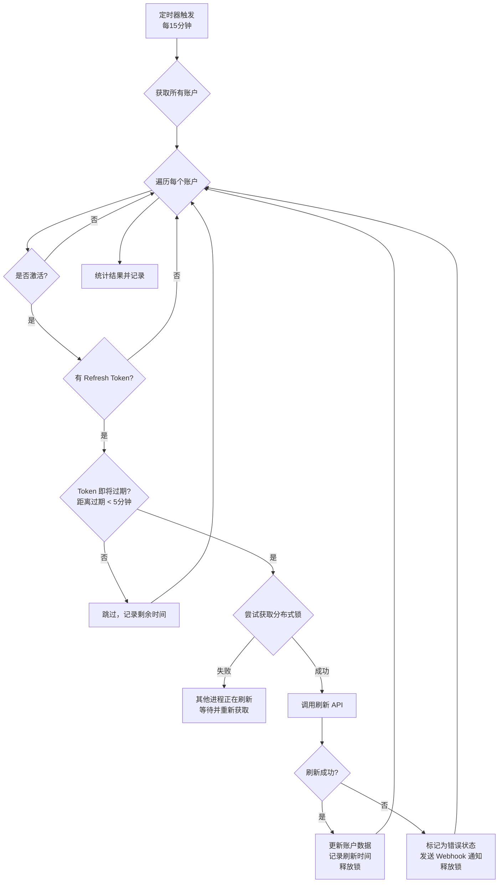

# Token 主动刷新机制使用指南

## 📌 概述

项目提供了两种 Token 刷新策略：

| 策略 | 触发时机 | 优势 | 劣势 |
|------|---------|------|------|
| **惰性刷新** (默认) | 请求到来时实时检测 | 节省资源，实现简单 | 首次过期有 2-3 秒延迟 |
| **主动刷新** (可选) | 定时后台扫描 | 无首次延迟，token 始终有效 | 消耗更多资源和 API 调用 |

## 🎯 适用场景

### 推荐使用主动刷新

✅ **高并发生产环境**：请求量大，不能容忍任何延迟
✅ **严格 SLA 要求**：响应时间必须稳定可控
✅ **长期闲置账户**：有些账户长时间不用但需要保持可用
✅ **实时监控需求**：需要主动监控所有账户 token 状态

### 适合保持惰性刷新

✅ **个人开发环境**：账户数量少，请求频率低
✅ **资源受限场景**：Redis/API 调用有配额限制
✅ **账户使用不均**：大部分账户长期不使用

## 🚀 快速启用

### 1. 环境变量配置

在 `.env` 文件中添加：

```bash
# 启用主动刷新
ENABLE_PROACTIVE_TOKEN_REFRESH=true

# 刷新检查间隔（分钟），默认 15 分钟
TOKEN_REFRESH_INTERVAL=15

# 提前刷新窗口（分钟），默认 5 分钟
# Token 在过期前 5 分钟开始刷新
TOKEN_REFRESH_WINDOW=5
```

### 2. 重启服务

```bash
npm run service:stop
npm run service:start:daemon

# 或使用 Docker
docker-compose restart
```

### 3. 验证启动

检查日志确认服务已启动：

```bash
npm run service:logs

# 应该看到类似输出：
# 🔄 Token refresh scheduler started (interval: 15 minutes, window: 5 minutes)
```

## ⚙️ 配置参数详解

### `TOKEN_REFRESH_INTERVAL`

**检查间隔**，决定多久扫描一次所有账户。

| 值 | 适用场景 | 资源消耗 |
|----|---------|---------|
| 5 分钟 | 高并发生产环境 | 高 |
| 15 分钟 | 一般生产环境（推荐） | 中 |
| 30 分钟 | 低频使用/资源受限 | 低 |

**计算公式**：
```
每小时扫描次数 = 60 / TOKEN_REFRESH_INTERVAL
例如：15 分钟 → 每小时扫描 4 次
```

### `TOKEN_REFRESH_WINDOW`

**提前刷新窗口**，决定在 token 过期前多久开始刷新。

| 值 | 说明 | 风险 |
|----|------|------|
| 3 分钟 | 激进策略 | Token 可能在刷新前过期 |
| 5 分钟 | 平衡策略（推荐） | 较低 |
| 10 分钟 | 保守策略 | 刷新频率过高 |

**Claude Token 过期检测**：60 秒提前量（代码硬编码）
**Gemini Token 过期检测**：10 秒提前量（代码硬编码）

**推荐配置**：
```bash
# 平衡配置（推荐）
TOKEN_REFRESH_INTERVAL=15
TOKEN_REFRESH_WINDOW=5

# 高可用配置
TOKEN_REFRESH_INTERVAL=10
TOKEN_REFRESH_WINDOW=5

# 资源节省配置
TOKEN_REFRESH_INTERVAL=30
TOKEN_REFRESH_WINDOW=10
```

## 📊 工作流程



## 🔍 监控和调试

### 查看服务状态

通过日志查看：

```bash
# 查看启动日志
npm run service:logs | grep "Token refresh scheduler"

# 查看刷新日志
npm run service:logs | grep "Proactively refreshing"

# 查看错误日志
npm run service:logs | grep "Failed to refresh.*token"
```

### 典型日志输出

**启动成功**：
```
🔄 Token refresh scheduler started (interval: 15 minutes, window: 5 minutes)
```

**定期检查**（无需刷新）：
```
🔍 Token refresh check completed: no tokens need refresh (1234ms)
```

**执行刷新**：
```
🔄 Proactively refreshing Claude token for: MyAccount (abc-123)
✅ Successfully refreshed Claude token for: MyAccount (abc-123)
✅ Token refresh completed: 3 refreshed, 5 skipped, 0 failed out of 8 checked (2345ms)
   Claude: 2 refreshed, 0 failed
   Gemini: 1 refreshed, 0 failed
```

**刷新失败**：
```
❌ Failed to refresh Claude token for MyAccount (abc-123): Invalid refresh token
⚠️ Encountered 1 errors during refresh:
   Claude - MyAccount (abc-123): Invalid refresh token
```

### 手动触发刷新

可以通过代码手动触发一次刷新（用于测试）：

```javascript
const tokenRefreshScheduler = require('./services/tokenRefreshScheduler')
await tokenRefreshScheduler.manualRefresh()
```

## 🎛️ 性能影响分析

### 资源消耗对比

假设有 **10 个 OAuth 账户**：

| 指标 | 惰性刷新 | 主动刷新<br/>(15分钟/次) |
|------|---------|----------------------|
| **CPU 占用** | 按需（请求时） | 定期（每15分钟） |
| **Redis 读取** | ~10 次/请求 | ~40 次/小时 (10账户×4次) |
| **API 调用** | 按需 | ~0-40 次/小时 (取决于过期账户数) |
| **内存占用** | 低 | 低 (+几十KB) |

### 成本估算

**Upstash Redis 免费套餐**（10,000 命令/天）：

```
主动刷新每天消耗 ≈ 960 命令 (10账户 × 4次/小时 × 24小时)
占用配额：9.6%
结论：完全可行
```

**Claude/Gemini API 调用**：
- Token 刷新 API 调用**不计费**
- 只有实际的 message API 才计费
- 主动刷新**不会增加费用**

## ⚠️ 注意事项

### 1. 分布式部署

如果有**多个服务实例**，建议：

✅ **仅在一个实例启用主动刷新**
✅ **其他实例保持惰性刷新**（作为备份）

配置示例：
```bash
# Instance 1 (主节点)
ENABLE_PROACTIVE_TOKEN_REFRESH=true

# Instance 2-N (工作节点)
ENABLE_PROACTIVE_TOKEN_REFRESH=false
```

### 2. Refresh Token 失效

主动刷新**无法解决** Refresh Token 本身失效的问题：
- Google OAuth Refresh Token：6 个月不使用会失效
- Claude OAuth Refresh Token：需要定期重新授权

### 3. 网络问题

如果账户配置了代理，确保代理稳定可用，否则刷新会失败。

### 4. 限流问题

Claude/Gemini 对 token 刷新 API 也有速率限制（虽然很高），如果账户数量非常多（>100），建议：
- 增大 `TOKEN_REFRESH_INTERVAL`
- 分批处理（修改代码逻辑）

## 🔄 混合策略（最佳实践）

推荐同时保留两种机制：

```javascript
// ✅ 主动刷新：定期检查，保持 token 新鲜
ENABLE_PROACTIVE_TOKEN_REFRESH=true
TOKEN_REFRESH_INTERVAL=15
TOKEN_REFRESH_WINDOW=5

// ✅ 惰性刷新：作为兜底，防止主动刷新失败
// 已内置在 getValidAccessToken() 中，无需额外配置
```

**工作流程**：
1. 后台定时刷新 → 保持 token 始终有效
2. 请求到来时检测 → 如果主动刷新失败，再次尝试

这样可以：
- **最大化可用性**：双重保障
- **最小化延迟**：大部分请求无需刷新
- **容错能力强**：一种机制失败，另一种兜底

## 📈 故障排查

### 问题 1：服务未启动

**现象**：日志中没有 "Token refresh scheduler started" 信息

**排查**：
```bash
# 1. 检查环境变量
echo $ENABLE_PROACTIVE_TOKEN_REFRESH  # 应该输出 true

# 2. 检查配置文件
cat .env | grep ENABLE_PROACTIVE_TOKEN_REFRESH

# 3. 重启服务
npm run service:stop
npm run service:start:daemon
```

### 问题 2：刷新失败率高

**现象**：大量 "Failed to refresh" 错误日志

**可能原因**：
1. Refresh Token 已失效 → 重新 OAuth 授权
2. 代理不可用 → 检查代理配置
3. API 限流 → 减少刷新频率

### 问题 3：性能影响

**现象**：服务 CPU 或内存占用增高

**优化方案**：
1. 增大 `TOKEN_REFRESH_INTERVAL`（如 30 分钟）
2. 禁用不活跃账户的主动刷新
3. 检查是否有内存泄漏

## 🎓 总结

| 场景 | 推荐配置 |
|------|---------|
| 个人开发 | 禁用主动刷新 |
| 小团队 | 惰性刷新即可 |
| 生产环境 | 启用主动刷新 (15分钟) |
| 高并发 | 启用主动刷新 (10分钟) |
| 资源受限 | 启用主动刷新 (30分钟) 或禁用 |

**记住**：主动刷新是**增强可用性**的工具，不是必需品。如果你的使用场景能接受偶尔的 2-3 秒延迟，惰性刷新完全够用。
